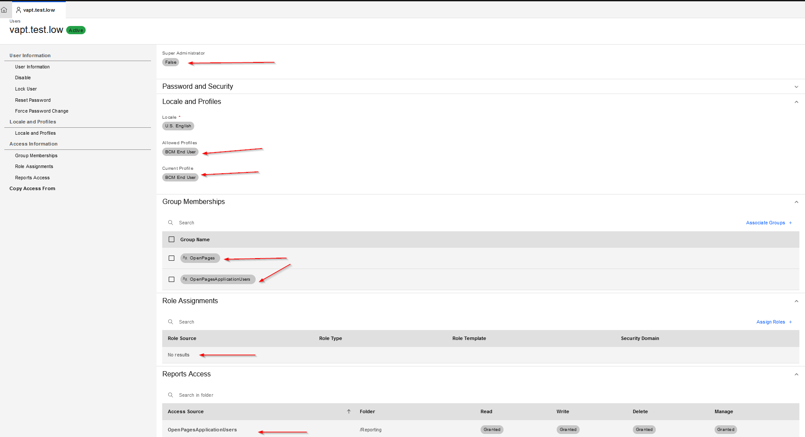
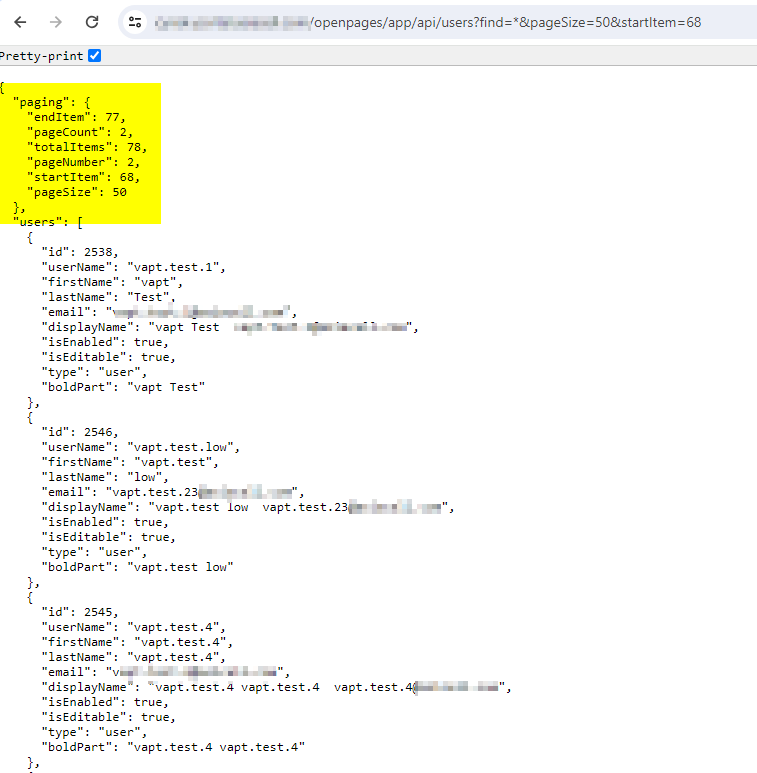
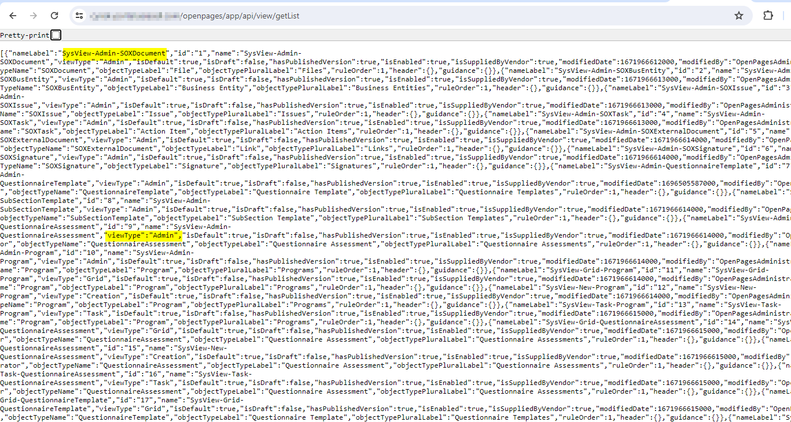

# Broken Access Control Vulnerability in IBM OpenPages (CVE-2024-35151)

## Overview

This page details the analysis and mitigation recommendations for a broken access control vulnerability in IBM OpenPages® with Watson™, version 8.3.0.2.4. The vulnerability allows unauthorized users to access sensitive administration pages, exposing critical system configurations, user details, and security roles.

---

## Vulnerability Details

- **Vendor**: IBM
    
- **Application**: IBM OpenPages® with Watson™
    
- **Version**: 8.3.0.2.4
    
- **Vulnerability Type**: Broken Access Control
    
- **Affected Components**: Administration Pages
    
- **Impact**: Unauthorized access to sensitive data, system configurations, and user details.
    
- **Root Cause**: Lack of server-side access control enforcement for predictable URL patterns.
    

### Example Exploitable URLs

1. `{domain}/openpages/app/api/actors?find=*`
    
2. `{domain}/openpages/app/api/users?find=*&pageSize=50&startItem=0`
    
3. `{domain}/openpages/app/api/admin/groups/tree`
    
4. `{domain}/openpages/app/api/admin/migration/export/processes`
    
5. `{domain}/openpages/app/api/registry/children`
    
6. `{domain}/openpages/app/api/securityrule/all`
    
7. `{domain}/openpages/app/api/view/getList`
    

---

## Exploitation Steps

### Step 1: Log In as a Low-Privilege User

- **Action**: Use a user account assigned the “PCM End User” role.
    
- **Result**: Gain basic access to the system.
    

### Step 2: Access Administrative URLs

- **Action**: Navigate to the affected URLs (listed above) directly in a browser.
    
- **Result**: Gain unauthorized access to sensitive administration pages without authentication or authorization checks.
    

### Step 3: Observe Sensitive Data

- **Action**: Review the data accessible through the administrative endpoints.
    
- **Result**: Obtain details such as user configurations, security roles, and system configurations.
    
---

## Screenshots

### Privileges of Low-Privilege User

- Screenshot showing the user’s assigned role (“PCM End User”) taken from the admin view.
    

### Unauthorized Access to Administrative Pages

- Screenshots illustrating access to:
    
    - Sensitive user details.
        
    - Security roles.
        
    - Other administrative configurations.
        

---

## Impact

This vulnerability exposes sensitive information to unauthorized users, including:

1. **System Configurations**: Details of system settings and operations.
    
2. **User Details**: Information about registered users.
    
3. **Security Roles**: Visibility into roles and permissions within the application.
    

---

## Mitigation Recommendations

1. **Enforce Server-Side Access Controls**: Restrict access to administrative endpoints based on user roles and privileges.
    
2. **Implement Authorization Middleware**: Add robust authorization checks for all sensitive URLs.
    
3. **Log Unauthorized Access Attempts**: Record attempts to access admin pages for auditing purposes.
    
4. **Regular Security Audits**: Conduct periodic reviews to identify and resolve access control gaps.
    

---

## Timeline

- **Date of Discovery**: [12-03-2024]
    
- **Vendor Response**: [13-03-2024]
    
- **Patch Release**:        [05-09-2024]
    
- **Public Disclosure**: [01-10-2024]
    

---

## Disclaimer

This repository is intended for educational and research purposes only. Unauthorized use of this information may violate laws or agreements. Use responsibly.

---

## References
   
- [IBM Security Bulletin](https://www.ibm.com/support/pages/node/7165959)
- [NIST NVD CVE-2024-35151 Detail](https://nvd.nist.gov/vuln/detail/CVE-2024-35151)
